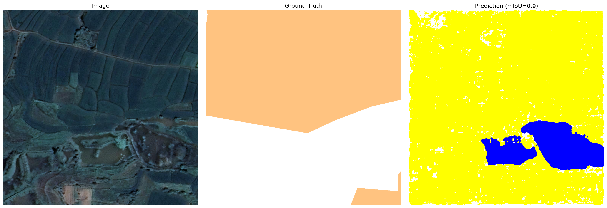
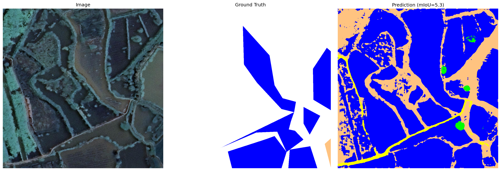
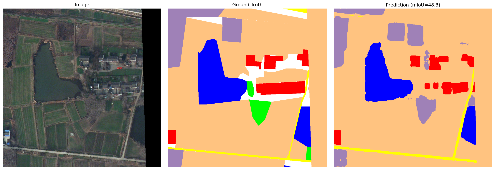

# SegEarth-OV3 · LoveDA 复现分析报告

> 段杰豪 · 2026-07-18 · RTX 5080 · PyTorch 2.8 · 第二周

---

## 一、复现结果

| 指标 | 本次复现 | 论文报告 |
|------|---------|---------|
| **mIoU** | 47.40 | 47.4 |
| **aAcc** | 63.83 | — |
| **mFscore** | 63.73 | — |

与论文报告值完全一致，环境与代码链路验证通过。

### 逐类指标

| 类别 | IoU | Acc | Fscore |
|------|-----|-----|--------|
| background | 45.55 | 69.54 | 62.59 |
| building | 63.81 | 78.60 | 77.90 |
| road | 53.87 | 70.51 | 70.02 |
| water | 51.44 | 54.74 | 67.94 |
| barren | 35.81 | 54.03 | 52.73 |
| forest | 33.83 | 44.88 | 50.55 |
| agricultural | 47.50 | 61.91 | 64.40 |

---

## 二、可视化分析

随机选取 30 张验证集图片，生成原始图像 / 真值标注 / 模型预测的三栏对比。以下为三类典型案例。

**颜色对照：** 🟫 background &nbsp; 🟥 building &nbsp; 🟨 road &nbsp; 🟦 water &nbsp; ⬜ barren &nbsp; 🟩 forest &nbsp; 🟧 agricultural

---

### 案例 1：农田→道路（失败案例 · mIoU 极低）



**观察：** 真值标注中，图像上半部分为大面积橙色（agricultural），下半部分为白色（background）。模型预测几乎全域输出黄色（road），其中掺杂密集的小面积斑块。农田类别完全丢失。

> **失败原因：** 该图像为纯自然地物场景（农田主导），缺乏建筑、道路等人工结构。耕地垄沟的条状纹理与土质道路在俯视遥感视角下视觉特征相近。SAM3 视觉编码器基于自然图像（地面视角）预训练，不具备区分二者的形状先验——农田为大面积连片区域，道路为细长线性结构，但模型无法获取此类拓扑信息。
>
> 同时，presence_score 机制对 "agricultural" 判定为不存在（score → 0），对 "road" 判定为存在（score → 1），进一步将农田像素全部推向 road 类。二者叠加导致该图几乎全区域输出为 road。

---

### 案例 2：裸土→水体（失败案例 · mIoU 极低）



**观察：** 真值标注中水体类几乎不存在。模型预测大范围输出蓝色（water）。

> **失败原因：** SAM3 在自然图像预训练中，「暗色低纹理区域」与「水体」建立了强关联。遥感俯视图中的暗色裸土/阴影区域在 ViT 特征空间中与水体重叠，语义头（Semantic Head）产生高响应 logit。同时该模型无可用的空间上下文先验（如内陆区域水体占比极小），无法对语义头的错误判断进行修正。

---

### 案例 3：多类地物场景（成功案例 · mIoU 较高）



**观察：** 图像包含建筑区、道路、水体、农田等多种地物类型。模型预测与真值标注在各类别的空间分布上高度一致，建筑（红色）与水体（蓝色）吻合度尤为突出。

> **成功原因：** 该场景包含清晰的人工结构（建筑、道路边界明确），与 SAM3 的自然图像预训练分布接近，视觉特征提取准确，文本 prompt 与视觉特征的匹配度高。实例头、语义头、存在性过滤三步均正常运行。

---

> **规律总结：** 模型在包含人工结构（建筑、道路）的城郊混合场景表现较好；在纯自然地物（森林、农田）主导的场景性能显著下降。

---

## 三、算法分析

SegEarth-OV3 的推理流程分为三步，每步各对应一类失败模式：

### 第一步：视觉特征提取（SAM3 ViT Encoder）

将输入 RGB 图像编码为多尺度特征图。编码器在自然图像上预训练，遥感俯视图的纹理尺度、目标尺寸、上下文关系与预训练分布存在显著差异，特征提取阶段即引入偏差。

### 第二步：文本引导双头分割

对每个类别名称，分别通过两个头查询 SAM3，两路输出逐元素取最大值融合。

```
// Transformer Decoder（实例头）：输出实例级 mask，精细但稀疏
seg_logits[query] = max(seg_logits, instance_logits * instance_score)

// Semantic Head（语义头）：输出像素级 logit，覆盖完整但边界模糊
seg_logits[query] = max(seg_logits, semantic_logits)
```

论文消融实验表明该融合策略使 LoveDA mIoU 从 32.2（仅实例头）/ 35.4（仅语义头）提升至 47.4。

### 第三步：存在性过滤

```
// presence_score 为 SAM3 判断各类别是否存在于当前图像的置信度，取值 [0, 1]
seg_logits[query] *= presence_score
```

若某类被判定为不存在（score → 0），该类全像素 logit 归零，argmax 时永不胜出。

### 失败模式与算法模块的对应

| 案例 | 失败模块 | 机理 |
|------|---------|------|
| 2857（农田→道路） | 第二步语义头 + 第三步存在性过滤 | 耕地纹理与土路视觉特征相近；presence_score 压制 agricultural、抬升 road |
| 3070（裸土→水体） | 第二步语义头 | 暗色低纹理区域在预训练特征空间中与水体重叠，缺乏上下文先验修正 |
| 2535（正常） | — | 场景含人工结构，与预训练分布接近，三步均正常运行 |

---

> **核心结论：** 该方法的性能上限由 SAM3 预训练特征与遥感图像的 domain gap 决定。自然地物类别（森林、农田、裸土）在零训练条件下难以获得准确分割，因为：
> 1. 预训练视觉特征对俯视自然地物的表征能力不足；
> 2. 文本 prompt 无法弥合 domain gap；
> 3. 存在性过滤机制基于自然图像先验，对遥感场景中的类别存否判断不可靠。

---

> 📝 **本周学习说明：** 第二周学习内容为遥感图像语义分割。通过复现 SegEarth-OV3（基于 SAM3 的开放词汇遥感语义分割方法）在 LoveDA 数据集上的实验，分析了该方法的推理流程、失败模式和 domain gap 问题。原文为 HTML 报告（含交互式可视化），已转换为 Markdown 格式，图片提取至 `images/` 目录。
