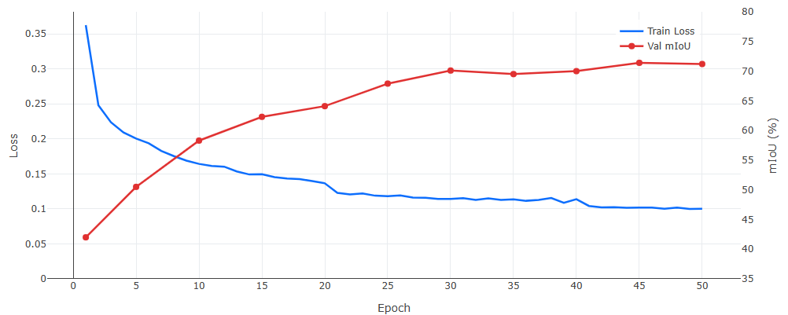
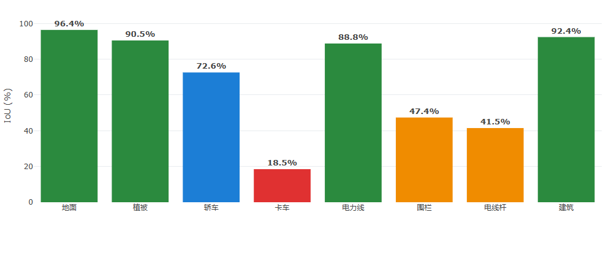

# PointNet++ · 航空 LiDAR 点云语义分割

> 段杰豪 · 2026-07 · 第三周（实践部分） · 深圳大学
>
> DALES 数据集 · 8 类语义分割

---

## 核心指标

| 指标 | 数值 |
|------|------|
| **测试集 mIoU** | 68.5% |
| **测试集 OA** | 96.7% |
| **训练 + 验证 Tiles** | 24 + 5 |
| **模型参数量** | 967K |

---

## 📋 任务概述

使用 **PointNet++** 对 **DALES**（Dayton Annotated LiDAR Earth Scan）航空激光点云数据集进行语义分割。DALES 单个 tile 覆盖 500m×500m 区域，包含 50 万~200 万点，无法直接输入显存有限的 GPU。因此将每个 tile 切分为 **20m×20m 的 block**，每 block 随机采样 **4096 个点**，逐块归一化后送入模型。

任务目标：对每个点预测其所属类别（地面、植被、轿车、卡车、电力线、围栏、电线杆、建筑，共 8 类）。

> ⚡ **关键教训：** 初期 V1 使用**块级（block）随机划分**——从 3 个 tile 内随机抽 block，按 80% 训练 / 20% 验证切分。由于同 tile 的 block 高度相关，验证集虚高（mIoU 57.3%），测试集仅 54.9%。
>
> V2 改为**按 tile（文件）严格划分**：从 29 个有标签 tile 随机抽 24 个训练 + 5 个验证，11 个独立 tile 测试。验证集 mIoU 提升至 **71.4%**，测试集 mIoU 从 54.9% 提升至 **68.5%**（+13.6%）。

---

## 🧠 模型结构

PointNet++ Encoder（4 层 Set Abstraction: 4096→1024→256→64→16）+ Decoder（4 层 Feature Propagation）+ 分类头。共 **967,432** 参数。

### 分类头（Prediction Head）

Decoder 输出每个点 128 维特征后，分类头通过两层 1×1 卷积将特征映射为 8 个类别的预测分数：

```python
self.conv1 = nn.Conv1d(128, 128, 1)       # 128 → 128，保持通道
self.bn1   = nn.BatchNorm1d(128)           # 批归一化
self.drop1 = nn.Dropout(0.5)               # 防止过拟合
self.conv2 = nn.Conv1d(128, num_classes, 1) # 128 → 8 类 logits
```

前向传播中：`Conv1d → BN → ReLU → Dropout(0.5) → Conv1d`，输出 (B, 8, N)，取 argmax 得到每个点的预测类别。

---

## ⚙️ 实验设置

| 项目 | 设置 |
|------|------|
| 数据集 | DALESObjects（40 tiles，~5 亿点，8 类语义标签） |
| 划分方式 | 24 训练 / 5 验证 / 11 测试 — 按 tile 严格划分 |
| 预处理 | 20m×20m block，每块随机采样 4096 点，逐块中心化 + 缩放至单位球 |
| 数据增强 | 随机绕 Z 轴旋转 |
| 优化器 | Adam (lr=0.001, weight_decay=1e-4) + StepLR (step=20, γ=0.5) |
| Batch Size | 16 |
| 训练轮数 | 50 epochs（最优 epoch 45） |

---

## 📈 训练曲线



---

## 📊 逐类 IoU（测试集）



> ⚠️ **卡车 IoU 为什么只有 18.5%？**
>
> 1. **数据极度稀缺**：训练集中卡车仅占 0.2%（14.8 万点 / 6128 万点），模型很难学到有效特征；
> 2. **形状混淆**：航空 LiDAR 俯视视角下，卡车顶部与轿车、平顶建筑局部形状接近，容易误分类；
> 3. **改进方向**：加权损失函数、过采样稀有类别、或引入强度（intensity）特征辅助区分。

---

## 🔍 3D 预测可视化

> **注：** 原始报告中使用 Plotly.js 实现交互式 3D 点云可视化（鼠标拖拽旋转、滚轮缩放、悬停显示类别与坐标）。以下为分析摘要：

### Block A — 低错误率 (1.9%)

- Tile: `5080_54470_new.ply`（7 类，缺卡车）
- 真实标签与模型预测高度一致
- 地面、建筑、植被均几乎无错

### Block B — 高错误率 (19.7%)

- Tile: `5100_54490_new.ply`（6 类，缺电力线、电线杆）
- **类别混淆严重**：包含轿车（275 点）和卡车（94 点），两者在航空俯视视角下形状相似，大量卡车被误判为轿车
- **缺少电力线和电线杆**：Block B 不含这两类，而 Block A 包含——说明电力线/电线杆这类**细长结构**的 block 错误率反而低（特征鲜明、易于区分）
- **建筑占比高**：建筑占 40%（1633/4096），部分建筑边缘点易与地面/植被混淆

### 颜色对照

| 🟫 地面 | 🟩 植被 | 🔵 轿车 | 🟡 卡车 | 🔴 电力线 | 🟠 围栏 | 🟪 电线杆 | 🔴 建筑 | 🟢 正确 | 🟥 错误 |
|------|------|------|------|------|------|------|------|------|------|

---

## 💡 总结

- 基于 PointNet++ 在 DALES 航空 LiDAR 数据集上实现 8 类语义分割，测试集 **mIoU 68.5%、OA 96.7%**。
- 地面（96.4%）、建筑（92.4%）、植被（90.5%）、电力线（88.8%）效果优秀。
- 轿车（72.6%）表现良好；卡车（18.5%）受限于数据稀缺（仅占 0.2%）。
- **核心教训**：点云数据划分必须以 tile（文件）为最小单位，块级随机划分会导致训练/验证泄露。
- **改进方向**：稀有类别的处理（重采样 / 加权损失）、引入额外的 LiDAR 属性（强度、回波次数）辅助区分易混淆类别。

---

> 📝 **本周学习说明：** 第三周实践部分——在 DALES 航空 LiDAR 数据集上使用 PointNet++ 完成 8 类语义分割任务。重点实践了数据预处理（tile→block→采样）、按 tile 严格划分避免数据泄露、以及分析稀有类别（卡车）的改进方向。原文为 HTML 报告（含 Plotly 交互式图表），已转换为 Markdown 格式，图表描述保留在文中。
