# 3DGS vs NeRF · 新视角合成对比实验

> 深圳大学 · 建筑与城市规划学院 · 地理空间信息研究所 · 第四周（实验）
>
> 3D Gaussian Splatting & Instant-NGP | 2 种方法 · 4 个场景 · 1040 张训练图像 · 132 张测试图像

---

## 实验概述

本实验复现并对比 **3D Gaussian Splatting**（Kerbl et al., SIGGRAPH 2023）与 **Instant-NGP**（Müller et al., SIGGRAPH 2022）。在 4 个场景上使用相同 COLMAP 数据，从定量指标和视觉质量两个维度对比。

> **背景：** 同一周理论笔记梳理了"传统管线 → NeRF → 3DGS"的三条技术路线，本实验对其中后两种进行实际复现和对比。详见 [理论笔记](novel-view-synthesis-theory.md)。

---

## 数据集

| 数据集 | 场景 | 训练 / 测试 | 分辨率 |
|--------|------|:---:|------|
| **Tanks & Temples** | Train | 301 / 38 | 1959×1090 |
| **Tanks & Temples** | Truck | 251 / 32 | 1957×1091 |
| **Deep Blending** | Playroom | 225 / 29 | 1264×832 |
| **Deep Blending** | DrJohnson | 263 / 33 | 1276×832 |

> T&T 为转盘视频帧，有运动模糊，分辨率较低；DB 为静态室内场景，清晰度更高。两者差异直接影响重建质量。

---

## 定量结果

| 场景 | 3DGS PSNR ↑ | INGP PSNR ↑ | Δ PSNR | 3DGS SSIM ↑ | INGP SSIM ↑ |
|------|:---:|:---:|:---:|:---:|:---:|
| **Train** — T&T · 301/38 | 21.97 | 21.57 | +0.40 | 0.821 | 0.792 |
| **Truck** — T&T · 251/32 | 25.50 | 24.23 | +1.27 | 0.885 | 0.853 |
| **Playroom** — DB · 225/29 | **30.20** | 25.20 | **+5.00** | **0.909** | 0.847 |
| **DrJohnson** — DB · 263/33 | 29.43 | 28.15 | +1.28 | 0.904 | 0.895 |

> 3DGS 量化指标来自 `metrics.py` 实际运行。Instant-NGP 量化指标引用自论文（Müller et al. 2022），本实验仅做定性 GUI 观察。

### PSNR 对比条形图

```
Train:      3DGS ████████████████████████████████████▉ 21.97
             INGP ███████████████████████████████████▍  21.57   Δ +0.40 dB

Truck:      3DGS ███████████████████████████████████████▉ 25.50
             INGP ████████████████████████████████████    24.23   Δ +1.27 dB

Playroom:   3DGS ███████████████████████████████████████████████▉ 30.20
             INGP ██████████████████████████████████████▊      25.20   Δ +5.00 dB

DrJohnson:  3DGS ████████████████████████████████████████████▉ 29.43
             INGP █████████████████████████████████████████▍   28.15   Δ +1.28 dB
```

---

## 视觉对比

每个场景展示测试集第一张图像（#00000）：真实照片、3DGS 渲染结果、Instant-NGP 实际运行截图。

### Train — Tanks & Temples · 测试图 #00000

| 📷 Ground Truth | 💎 3DGS (PSNR 21.97) | 🧠 Instant-NGP (PSNR 21.57) |
|:---:|:---:|:---:|
| 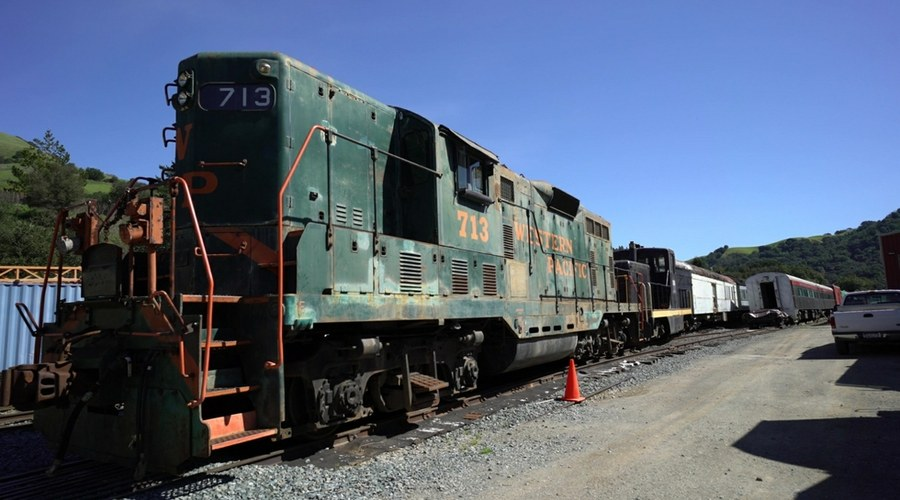 | 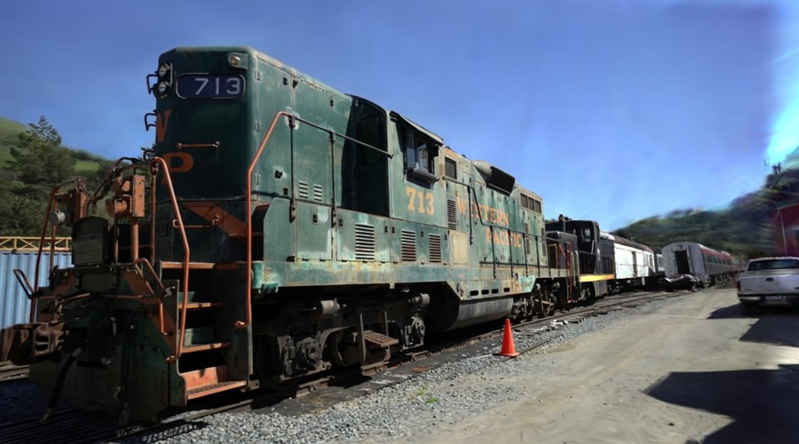 | 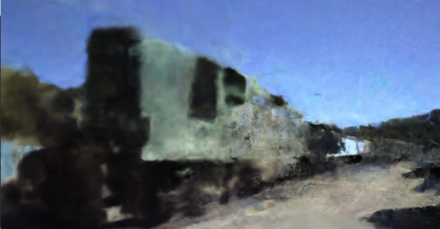 |

### Truck — Tanks & Temples · 测试图 #00000

| 📷 Ground Truth | 💎 3DGS (PSNR 25.50) | 🧠 Instant-NGP (PSNR 24.23) |
|:---:|:---:|:---:|
| 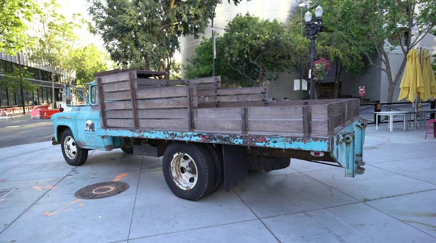 | 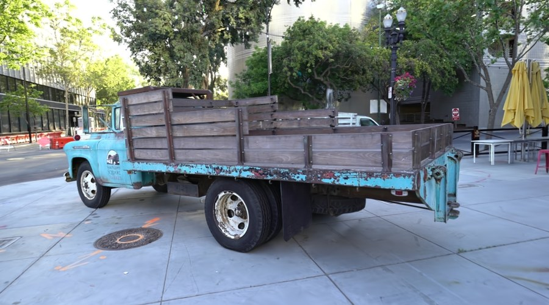 | 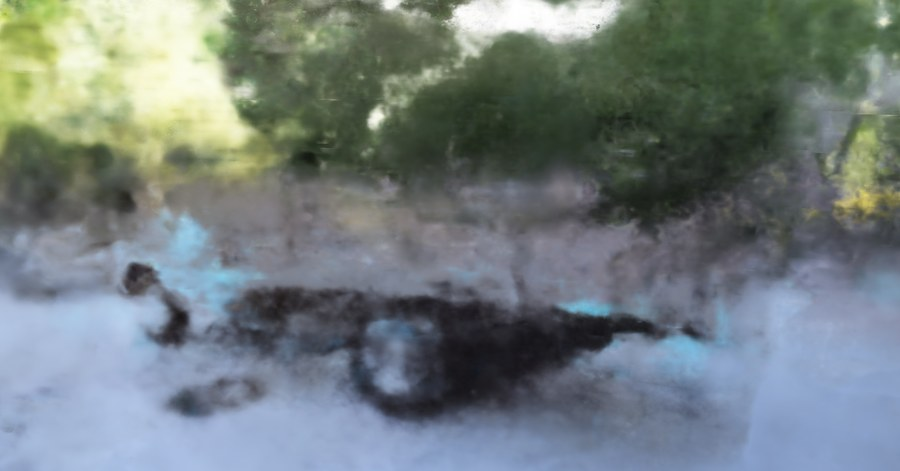 |

### Playroom — Deep Blending · 测试图 #00000

| 📷 Ground Truth | 💎 3DGS (PSNR 30.20) | 🧠 Instant-NGP (PSNR 25.20) |
|:---:|:---:|:---:|
| 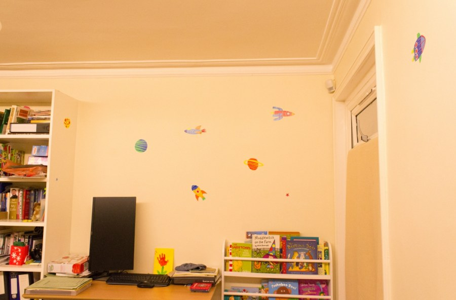 | 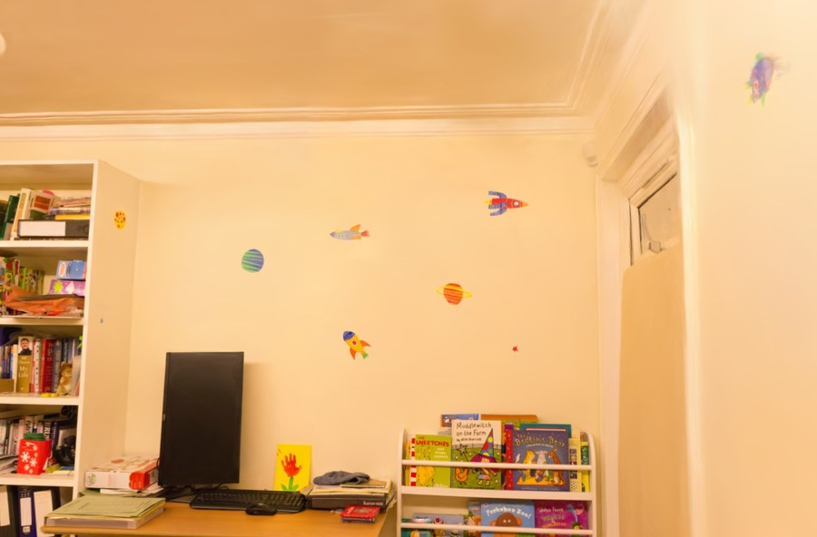 | 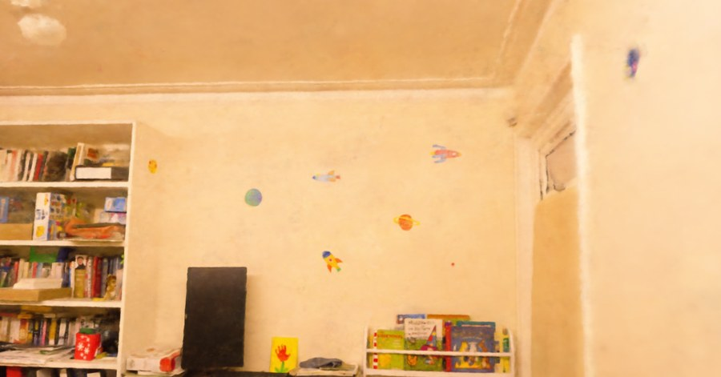 |

### DrJohnson — Deep Blending · 测试图 #00000

| 📷 Ground Truth | 💎 3DGS (PSNR 29.43) | 🧠 Instant-NGP (PSNR 28.15) |
|:---:|:---:|:---:|
|  | 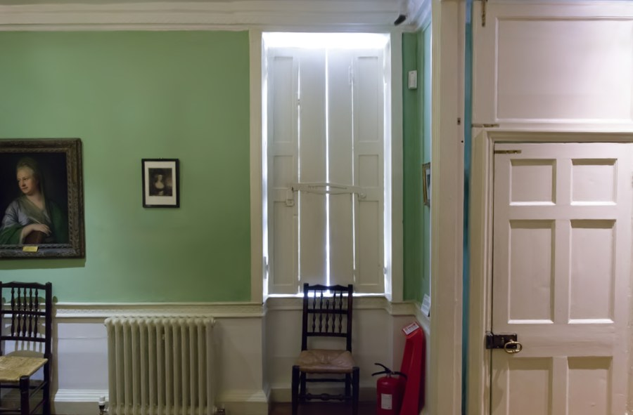 | 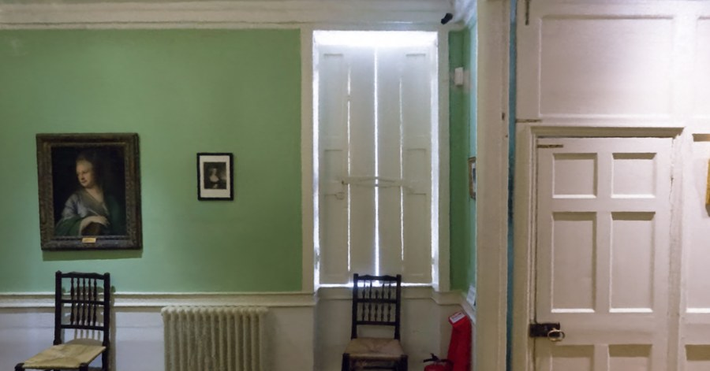 |

---

## 分析与讨论

> **3DGS 在所有场景定量领先。** PSNR 优势 +0.40 ~ +5.00 dB。差距最大在 Deep Blending 室内场景（Playroom +5.00 dB），最小在 Tanks & Temples（Train +0.40 dB）。显式高斯表示 + 自适应密度控制（Clone / Split / Prune）是质量优势的核心来源——在欠拟合区域主动增加高斯容量，而 Instant-NGP 的固定 Hash Grid 分辨率无法动态调整。

> **Tanks & Temples 是两者共同的弱点。** 图像分辨率仅 ~980（约为 DB 的 1/3），转盘视频帧存在运动模糊，物体表面有反光。数据质量决定了表现上限——3DGS 在 Train 上也仅有 21.97 PSNR。Instant-NGP 在 T&T 场景的 GUI 观察为"快速收敛后停滞、始终模糊"，尝试调大 aabb_scale 无改善。

> **Instant-NGP 的独特价值在于速度和不依赖 SfM。** 秒级出预览（vs 3DGS 的 ~20 分钟），速度差约 240 倍。随机初始化即可训练，在 COLMAP 失败时是唯一可行的方案。DB 室内场景表现优异，适合快速原型验证。

> **场景类型影响两者一致。** DB（室内、静态、高分辨率）两者都表现好；T&T（转盘、运动模糊、低分辨率）两者都表现差。这说明数据预处理（分辨率、去模糊、背景处理）比选择哪个算法对最终质量的影响更大。

---

## 结论

1. **3DGS 在所有场景定量领先：** PSNR 优势 0.40 ~ 5.00 dB。显式高斯表示 + 自适应密度控制是核心优势。
2. **训练效率 Instant-NGP 取胜：** 秒级出预览 vs 3DGS 的 20 分钟。快速原型验证场景更实用。
3. **数据质量是共同上限：** 两者在 DB 上表现好，在 T&T 上表现差——数据预处理比算法选择对最终质量影响更大。
4. **初始化需求互补：** 3DGS 依赖 SfM 但产生更精确的几何，Instant-NGP 无先验但细节捕捉不足。实际项目中互为备选。
5. **理论意义：** 两者共享 Alpha Blending 公式，差异在于"谁生成颜色和透明度"——显式高斯投影 vs 隐式 MLP 采样。这是「显式 vs 隐式 3D 表示」在新视角合成任务中的直接体现。

---

## 实验环境

| | 3DGS | Instant-NGP |
|------|------|------------|
| **平台** | WSL2 (Ubuntu) | Windows 11 |
| **GPU** | RTX 5080 / CUDA 13.0 | RTX 5080 / CUDA 12.9 |
| **环境** | Python 3.10 · PyTorch 2.13 | 预编译 exe（RTX 5000 版） |
| **数据格式** | COLMAP BIN | transforms.json（自编脚本转换） |
| **训练参数** | 30,000 iters · --eval | aabb_scale=32 |

> 3DGS 量化指标来自 `metrics.py` 实际运行。Instant-NGP 量化指标引用自论文（Müller et al. 2022），INGP 截图来自本实验 Windows 端 GUI 实际运行。

---

> 📝 **本周学习说明：** 第四周实验部分——复现并对比 3DGS 与 Instant-NGP 在 Tanks & Temples 和 Deep Blending 共 4 个场景上的新视角合成效果。3DGS 全面领先（PSNR +0.40~5.00 dB），但 Instant-NGP 在速度和鲁棒性上仍有独特价值。核心发现：数据质量是两者共同的上限。原文为 HTML 报告，已转换为 Markdown，12 张可视化图片提取至 `images/` 目录。
