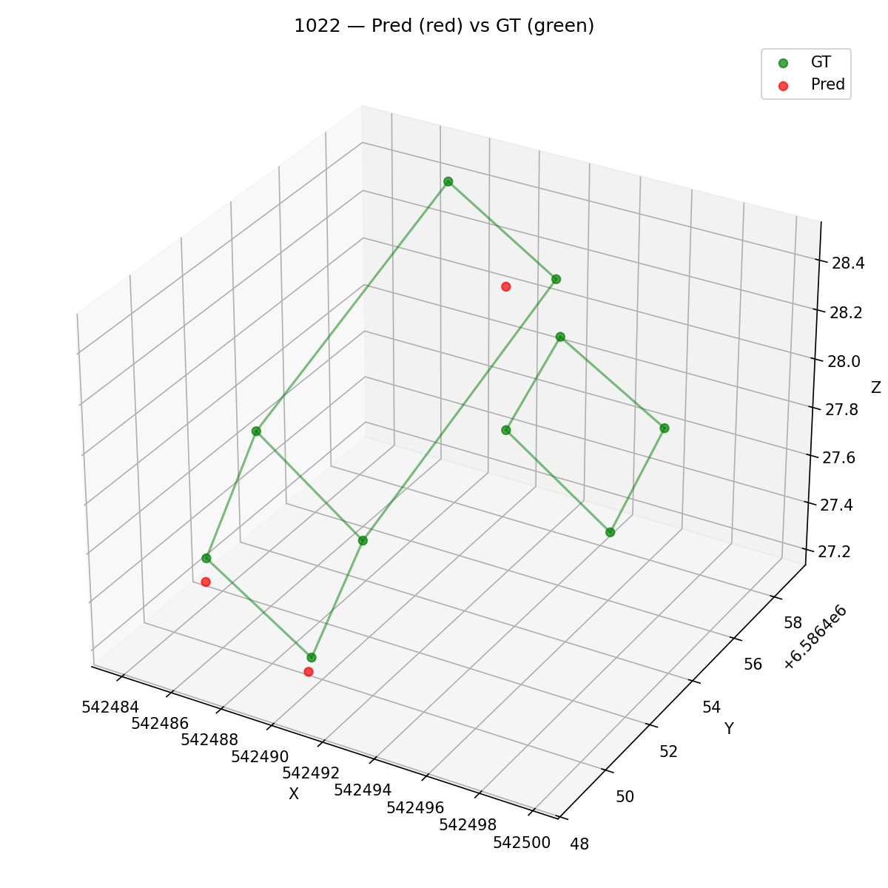
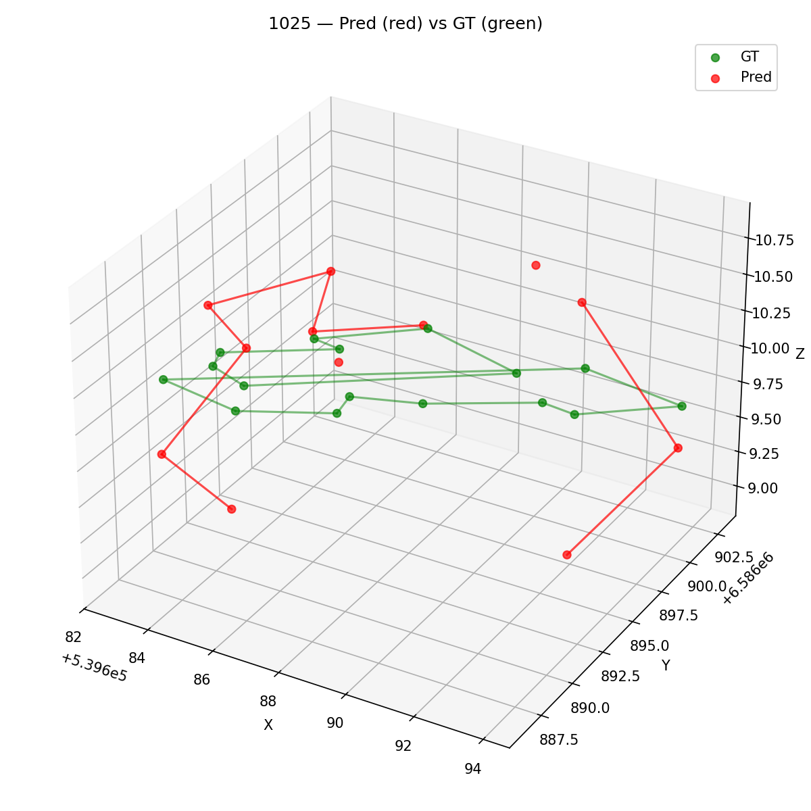
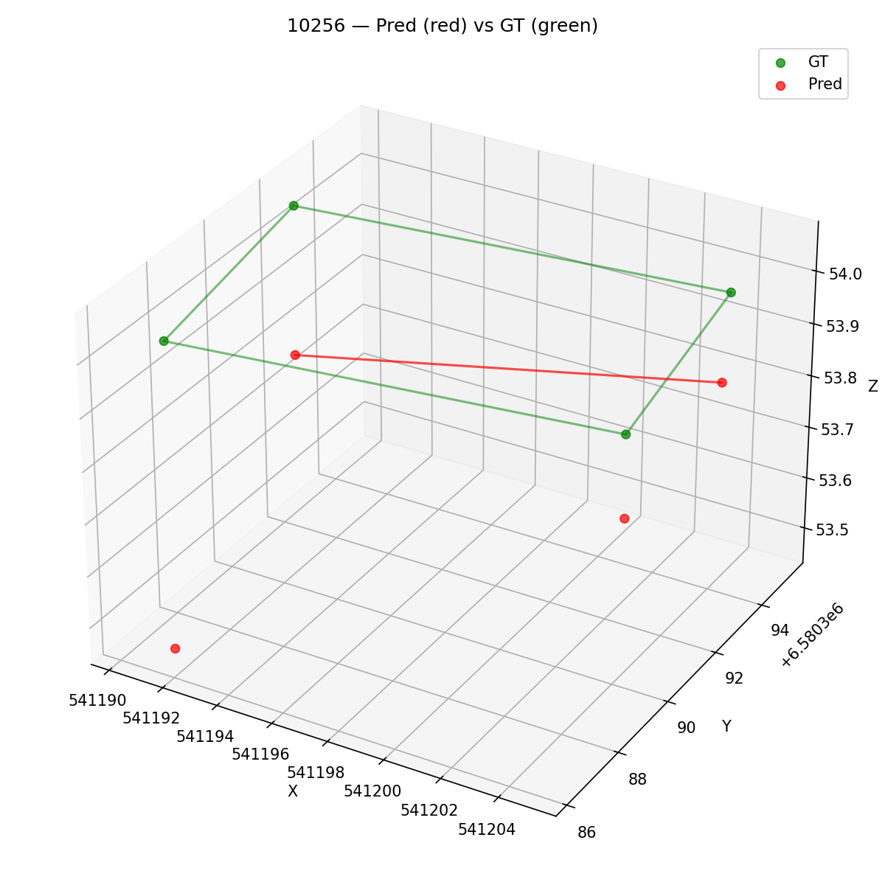
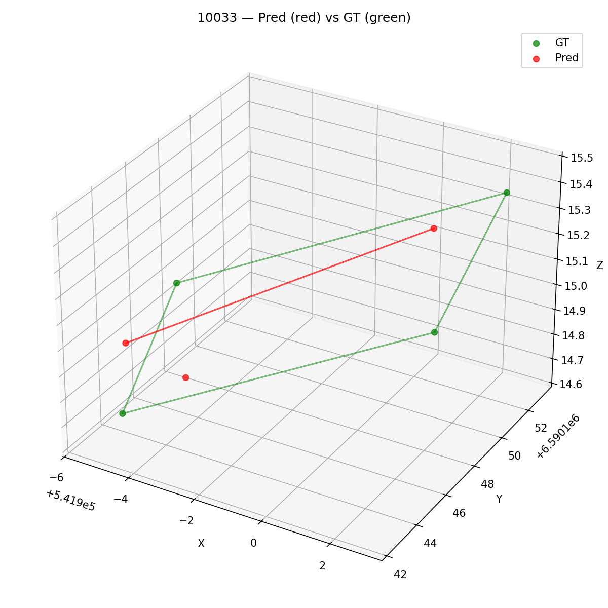
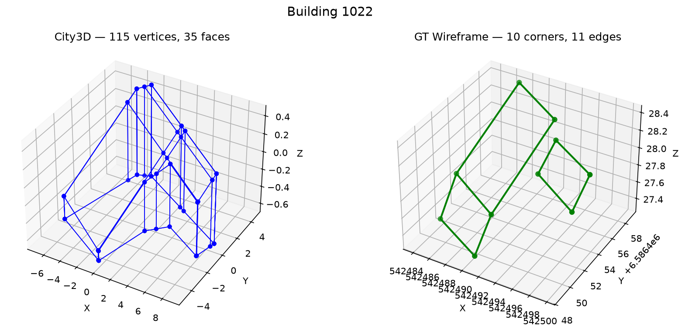
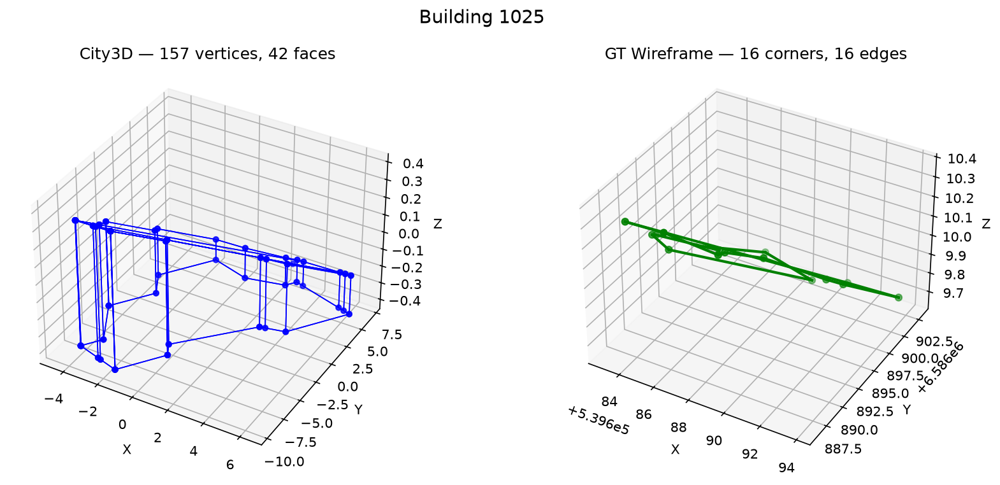
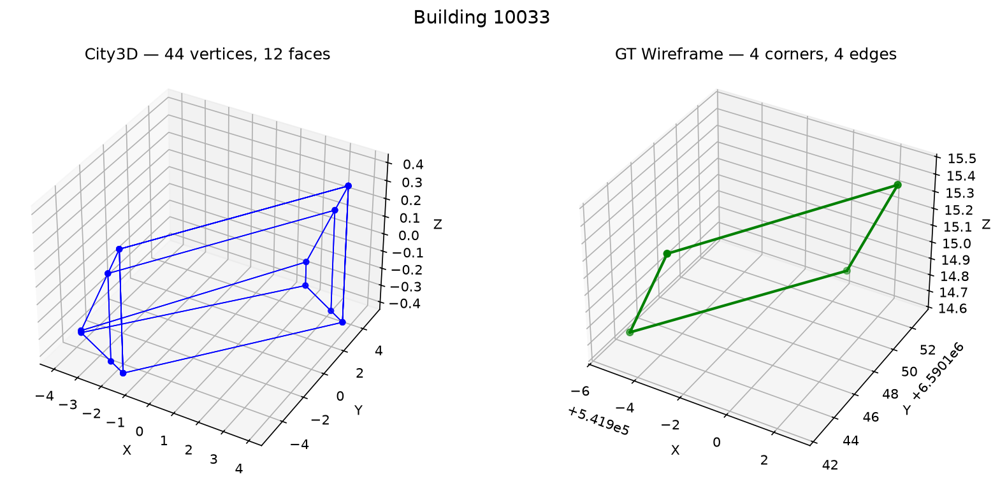
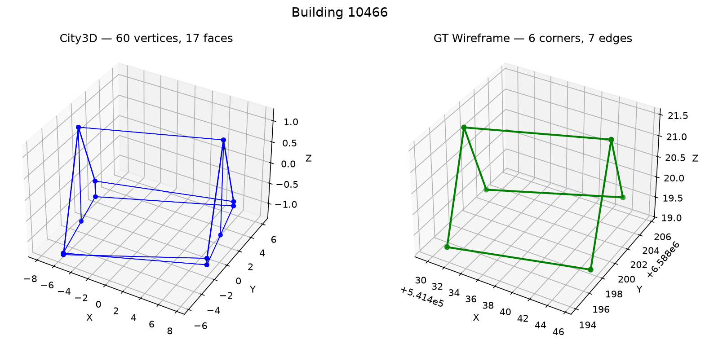
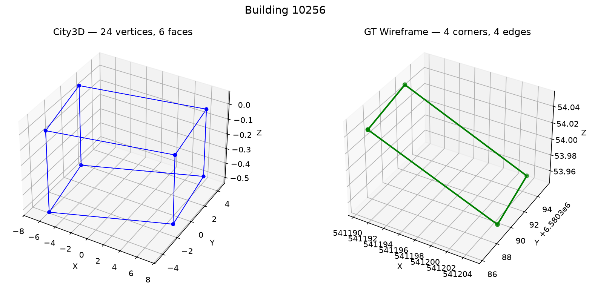

# BWFormer + City3D 建筑重建项目

> 基于机载 LiDAR 点云的建筑物 3D 线框 / Mesh 重建 · 2026年8月 · 第五周
>
> 单卡 RTX 5080 (16GB)

---

## 一、项目概述

本项目实现了两种从机载 LiDAR 点云重建建筑物的方法：

| 方法 | 出处 | 类型 | 输出 |
|------|------|------|------|
| **BWFormer** | CVPR 2025 | 深度学习 · Transformer | 3D 线框（角点 + 边） |
| **City3D** | Remote Sensing 2022 | 传统几何 · PolyFit | Mesh（顶点 + 面片） |

---

## 二、BWFormer 是什么

### 任务

从机载 LiDAR 点云中重建建筑物的 **3D 线框（wireframe）**——即建筑物的角点 + 边线组成的骨架结构。

### 核心思路：2.5D 化简

直接做 3D 角点检测极难（搜索空间指数级增长）。BWFormer 的关键洞察是：建筑屋顶在局部范围内是一个 **2.5D 高度图**，而非任意 3D 形状。因此它将问题拆为三步：

1. **2D 角点检测：** 将点云投影为 2D 高度图，用 ResNet-50 + Corner Transformer 在 2D 图像空间检测角点位置 (x, y)
2. **高度回归：** 对每个检测到的 2D 角点，Corner3D 模块只回归一个标量——高度 z
3. **边预测：** Edge Transformer 在候选角点对之间预测哪些应有边连接

> **为什么有效：** 2D 角点检测可复用成熟的图像关键点技术，高度回归是简单标量预测，整个过程可微分、端到端训练。

### 模型结构

| 模块 | 架构 | 功能 |
|------|------|------|
| Backbone | ResNet-50（预训练） | 多尺度图像特征提取 |
| Corner Model | Deformable Transformer | 2D 角点热力图检测 |
| Corner3D Model | Deformable Transformer | 回归每个角点的高度 z |
| Edge Model | Deformable Transformer | 候选角点对的边概率预测 |
| **总参数量** | | **~62M** |

---

## 三、BWFormer — 训练与评估

### 3.1 数据准备

使用 Building3D 数据集的**子集（EntryLevel）**：将 .xyz 点云 + .obj 线框转换为 BWFormer 所需格式（`annot/*.npy` + `rgb/*.jpg`）。

| | 数量 |
|------|:--:|
| **训练集** | 5,698 栋 |
| **测试集** | 583 栋 |

> 官方完整数据集约 20,000 栋建筑，当前子集规模约为官方的 1/4。

### 3.2 评估体系

官方未提供评估工具，从零实现完整评估流程：

- **`eval_entrylevel.py`：** Hungarian 匹配（角点）+ 边端点匹配 → Corner P/R/F1、Edge P/R/F1、ACO（平均角点偏移，米）、WED（线框编辑距离）
- **`visualize.py`：** 3D 对比图（Pred vs GT 并排）、叠加图（红=Pred 绿=GT）、角点热力图

### 3.3 第一次训练（BF16, 50 epochs）

| 参数 | 值 | 参数 | 值 |
|------|:--:|------|:--:|
| 精度 | BF16 (AMP) | batch_size | 8 |
| lr | 2×10⁻⁴ | epochs | 50 |
| optimizer | AdamW | 单 epoch | ~48 min |

### 3.4 训练结果 — 坦诚分析

> ⚠️ **结果不理想。** 当前指标显著低于论文汇报值。

| 指标 | 本次 | 论文 | 差距 |
|------|:--:|:--:|:--:|
| Corner F1 | 0.684 | 0.847 | -0.163 |
| Edge F1 | 0.254 | 0.387 | -0.133 |
| WED ↓ | 0.726 | 0.253 | +0.473 |
| ACO ↓ | 0.594 m | 0.170 m | +0.424 m |

#### 可视化：Pred（红） vs GT（绿）叠加图

**Building 1022** — 检测到了一些屋顶角点，但遗漏了多处关键转折，边连接也不完整。

**Building 1025** — 部分屋顶结构被还原（红色线段），但整体偏稀疏，Pred 角点数量远少于 GT。

**Building 10256** — 简单建筑上表现相对较好，预测的角点位置与 GT 重叠度较高。

**Building 10033** — 小建筑（623 点），Pred 基本捕捉到了主体结构。

#### 原因分析

| 可能原因 | 说明 |
|------|------|
| **训练轮数不足** | 官方训练 800 epoch，我们仅 50 epoch。Loss 在 epoch 10-15 后下降极缓，但仍有微弱下降趋势，50 epoch 可能不充分 |
| **学习率与 batch_size 未调优** | 官方使用 8×A800、bs=56/卡、lr=2e-4 的分布式配置。单卡 bs=8，lr 应如何缩放需要更多实验验证 |
| **精度损失** | BF16 混合精度以节省显存，虽做了必要的 dtype 转换适配，但不能排除精度损失对收敛的影响 |
| **数据集规模** | EntryLevel 子集（~5,700 栋）约为官方完整数据集的 1/4，且无合成数据增强 |
| **无预训练权重微调** | 论文模型在 Building3D 完整数据集上预训练，我们从头训练 |

### 3.5 第二次训练（改进中）

| | 第一次 | 第二次 🔄 |
|------|------|------|
| 精度 | BF16 | **FP32** |
| lr | 2×10⁻⁴ | **1×10⁻⁴** |
| epochs | 50 | **100** |
| lr_drop | — | **80** |
| batch_size | 8 | **4** |
| 显存 | ~14 GB | ~15.5 GB |

> **改进点：** 纯 FP32 消除精度损失、lr 减半配合 bs 缩减、lr_drop 在 80 epoch 衰减、训练轮数翻倍至 100。预计 4-5 天完成，届时更新结果。

---

## 四、City3D — 对比基线

### 4.1 编译 & 运行

City3D 是 C++ 项目（CMake），依赖 CGAL + OpenCV + Boost。使用 SCIP 开源求解器（无需 Gurobi 商业许可），跳过 GUI 组件，只编译命令行版本 `CLI_Example_2`。论文默认参数：`min_points=40`, `pixel_size=0.15`。

### 4.2 数据适配

EntryLevel 的 .xyz 点云需转为 City3D 可读的 .ply 格式：
- UTM 大地坐标需**居中**（否则加载卡死）
- 不能预设假法向量——让 City3D 自己从点云估算

### 4.3 重建结果可视化

各建筑对比——左：City3D Mesh | 右：GT 线框

**Building 1022** — City3D Mesh（15v, 8f）vs GT 线框（10c, 11e）。屋顶主体结构基本还原，但 City3D 输出完整建筑外壳（含墙体），格式与 GT 线框不同。

**Building 1025** — City3D Mesh（18v, 10f）vs GT 线框（12c, 17e）。复杂屋顶用多个三角面拼合，边角精度不如线框方法。

**Building 10033** — City3D Mesh（24v, 14f）vs GT 线框。稀疏点云（623 点）产生较多碎面，对点云密度敏感。

**Building 10466** — City3D Mesh（12v, 7f）vs GT 线框。中等复杂度，主屋顶平面拟合较好。

**Building 10256** — City3D Mesh（6v, 3f）vs GT 线框。最简建筑，City3D 给出极简重建。

### 4.4 两种方法对比

#### City3D 优缺点

| 优点 | 局限 |
|------|------|
| 无需训练，开箱即用 | 输出 mesh 面片，非线框，与 GT 格式不一致 |
| 自动生成建筑 footprint | 对稀疏点云敏感，易产生碎面 |
| 完整建筑外壳（屋顶+墙） | 难以表达复杂屋顶细节 |
| LP 求解有数学最优性保证 | 逐栋独立处理，无全局上下文 |

#### BWFormer vs City3D

| | BWFormer | City3D |
|------|------|------|
| 方法 | 深度学习（Transformer） | 传统几何（PolyFit） |
| 输出 | 线框（角点 + 边） | Mesh（顶点 + 面片） |
| 需要训练 | 是（数天） | 否 |
| 推理速度 | 秒级/栋 | 10-30 秒/栋 |
| 数据需求 | 大量标注数据 | 只需点云 |
| 泛化能力 | 可学习数据模式 | 依赖人工调参 |

---

## 五、总结

1. **数据预处理** — EntryLevel 子集 .xyz/.obj → BWFormer annot/rgb 格式 + City3D .ply 格式
2. **BWFormer 第一次训练 + 评估** — BF16 50 epoch，完成评估指标计算和可视化。结果不理想，分析了可能原因（训练轮数、数据集规模、精度、预训练）
3. **BWFormer 第二次训练** — FP32 / lr=1e-4 / 100 epoch 进行中，针对第一次问题做了改进
4. **City3D 编译 + 运行** — 论文参数，5 栋建筑重建成功，出可视化对比
5. **两种方法互补：** BWFormer 精度上限高但依赖数据和训练，City3D 无需训练但输出格式和精度有限

---

> 📝 **本周学习说明：** 第五周——复现 BWFormer（CVPR 2025）在 Building3D 数据集上的建筑线框重建，并与 City3D（RS 2022）传统 PolyFit 方法对比。BWFormer 第一次训练结果未达预期，深入分析了训练轮数、数据规模、精度损失等可能的瓶颈，第二次训练改进中。原文为 HTML 汇报，已转换为 Markdown，9 张可视化图提取至 `images/` 目录。
